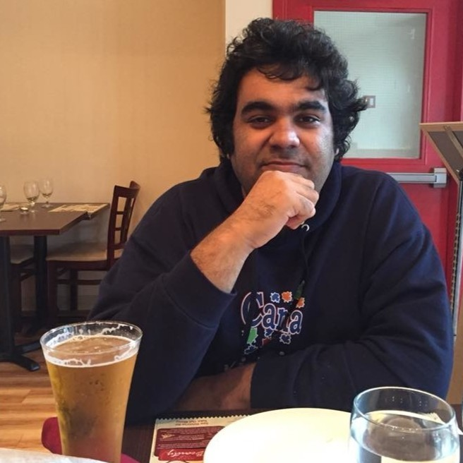

# **🚀 2-Day Python Bootcamp: Build Your Programming Foundations**

---

## **About the Bootcamp**

Join us for an immersive **2-day, hands-on Python Bootcamp** designed to take you from zero to confident beginner.  
Whether you are completely new to programming or have dabbled before, this workshop will equip you with the **essential building blocks of Python** and give you the confidence to continue your coding journey.  

You’ll not only learn the *what* and *how* of coding but also develop a **programmer’s mindset**—the ability to break down problems logically and translate them into working code.

---

## **🎯 Skill Learning Objectives**

By the end of this bootcamp, learners will be able to:

* Understand the **basic building blocks** of Python programming  
* Apply these concepts to **write functional programs**  
* Access and use **resources to keep learning independently**

---

## **📅 Session Plan (High Level)**

### **Day 1 (9:00 AM – 5:00 PM)**

| Time Slot | Session |
|-----------|---------|
| 9:00 – 9:55 AM | Welcome & Technical Setup (Install PyCharm, access resources) |
| 10:00 – 10:25 AM | Programming Mindset – What coding really means & how Python runs code |
| 10:30 – 12:00 PM | Core Building Blocks – Data Types, Variables, Input/Output |
| 12:00 – 12:45 PM | Lunch Break |
| 12:45 – 1:55 PM | Practice Session – Guided coding exercises |
| 2:00 – 3:25 PM | Flow of Control – Conditionals and Loops |
| 3:30 – 5:00 PM | Practice Session – Apply flow control to real problems |

---

### **Day 2 (9:00 AM – 5:00 PM)**

| Time Slot | Session |
|-----------|---------|
| 9:00 – 9:30 AM | Revision – Refresh Day 1’s concepts |
| 9:30 – 11:00 AM | Functions & Reusing Code – Write modular, reusable programs |
| 11:00 – 12:00 PM | Practice Session – Build confidence with exercises |
| 12:00 – 12:45 PM | Lunch Break |
| 12:45 – 2:15 PM | Modules & Packages – Explore Python’s built-in and external tools |
| 2:15 – 4:30 PM | Mega Practice Session – Apply everything in larger coding challenges |
| 4:30 – 5:00 PM | Closing & Next Steps – Roadmap for continuing your programming journey |

---

## **🧑‍🏫 Teaching Approach**

Each topic is broken into three parts:  

* **Mental Model** – Build an intuitive way to think about the concept  
* **Skill** – Learn how to implement it in Python  
* **Practice** – Reinforce learning with guided problem-solving  

You’ll walk away with **hands-on experience, practical exercises, and a clear path** to keep building your programming skills.

---

## **👩‍💻 Who Is This Bootcamp For?**

| ✔ A great fit if you are...                      | ✘ Might not be the right fit if...                       |
|--------------------------------------------------|----------------------------------------------------------|
| Completely new to programming                    | Already confident writing full Python programs           |
| A student looking to strengthen foundations      | Wanting advanced data science or AI in 2 days            |
| A professional transitioning into tech or data   | Unable to commit 2 full days to focused learning         |
| Curious about coding & problem-solving           | Prefer self-paced video-only courses                     |

**Prerequisites**

* Basic computer literacy – ability to install and use applications  
* No prior coding experience required – we start from the basics  

---

## **📦 What You’ll Need**

* A laptop (Windows/Mac/Linux)  
* Internet access  
* Willingness to learn and experiment!  

We’ll guide you through installing all necessary tools (like **PyCharm**) during the bootcamp.

---

## **✅ What You’ll Leave With**

* A **solid foundation** in Python programming  
* Completed **practice projects** you can build on  
* Confidence to **keep learning independently**  
* A **roadmap of resources** for your programming journey  

This is your chance to start programming from scratch in just **2 days** with the right mix of **theory, practice, and fun!**

---

## **Enrolment & next steps**

* **Bootcamp Dates:** Weekend of **November 1–2, 2025** or **December 6–7, 2025**  
* **Price:** 200 CAD
* **Seats:** Limited to 10 to keep workshops interactive

[**Register Now →**](https://forms.gle/x7qAfwzBngdA2UfH6)

Have questions? Email **hello@qurioskill.com**

---

## **About the Instructor**

 
### Madhav Malhotra

With over 10+ years of experience in software development, Madhav has held roles ranging from a Software Developer to Manager of multiple software development teams. 
He also completed a 2-year fellowship with Teach for India, working with under-served communities. 
Madhav is passionate about empowering individuals to thrive in their professional journeys by providing access to affordable learning resources.

👉 [Connect on LinkedIn](https://www.linkedin.com/in/madhav-malhotra-06239b128/)

---

## **About QurioSkill**

QurioSkill envisions a world where lack of skill is no longer holding back an individual from getting their dream job. 
We provide online cohort based skill training, enabling individuals in their upskilling and reskilling journey.

👉 [Website](https://www.qurioskill.ca/)

👉 [Connect on LinkedIn](https://www.linkedin.com/company/qurioskill/)

© QurioSkill, 2025. Fairness · Empathy · Empowerment